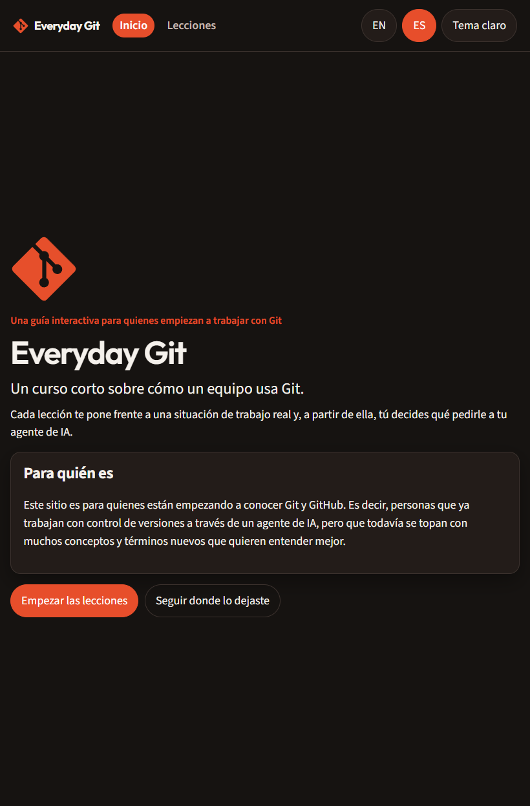
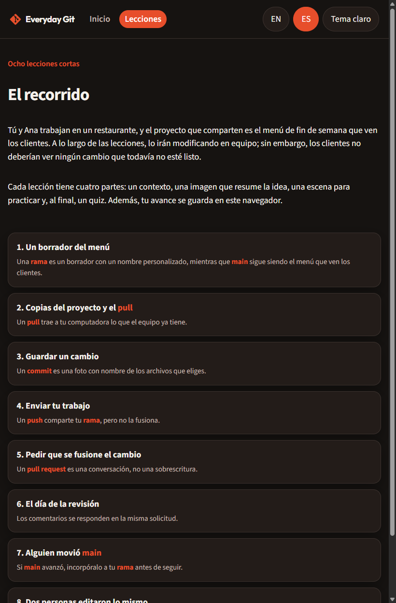
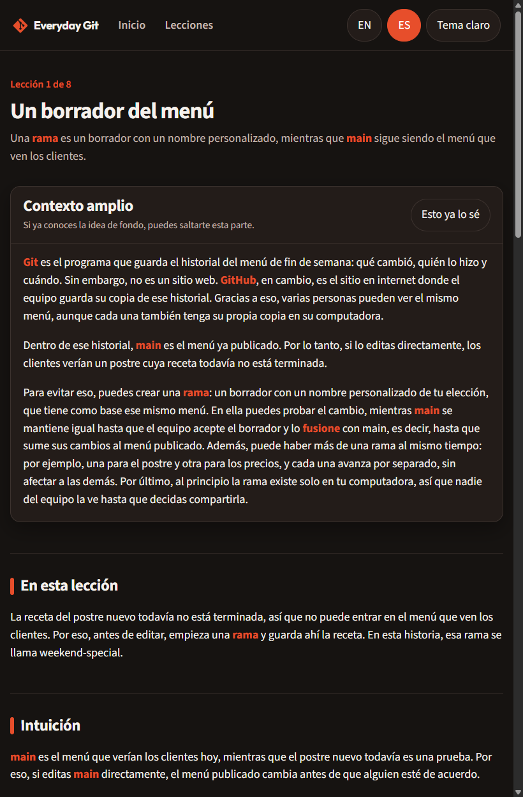
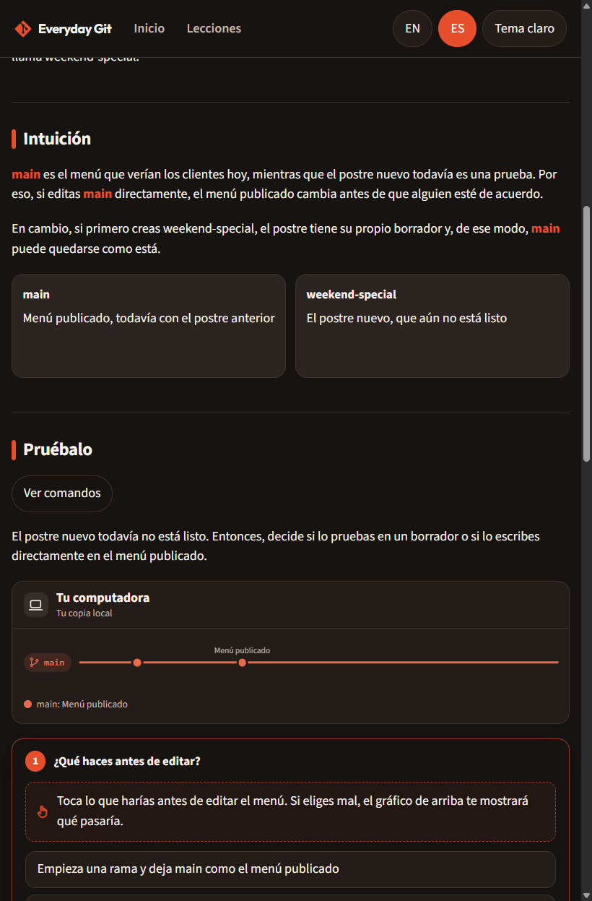

# Everyday Git

Guía interactiva para quienes empiezan a trabajar con Git y GitHub. El sitio enseña GitHub Flow: una rama principal, ramas cortas y un pull request para que alguien del equipo revise el cambio.

No hace falta escribir comandos. En cada lección aparece una situación de trabajo y la persona decide qué pedirle a su agente de IA. Los comandos reales quedan ocultos, detrás de un botón, por si alguien quiere verlos.

El sitio está en español (Latinoamérica) y en inglés, con tema claro y oscuro. El avance se guarda en el navegador.

## La historia

Tú y Ana trabajan en un restaurante. El proyecto es el menú de fin de semana que ven los clientes. A lo largo de las lecciones lo modifican en equipo, pero los clientes no deberían ver un cambio que todavía no está listo.

## Pantallas

### Inicio



### Recorrido



### Una lección

Cada lección tiene cuatro partes: un contexto que se puede saltar, la idea de esa lección, una escena para practicar y un quiz de cinco preguntas. La lección queda completa cuando se termina la práctica y se responden bien las cinco.





## Lecciones

1. **Un borrador del menú.** Una rama es un borrador con nombre. `main` sigue siendo el menú que ven los clientes.
2. **Copias del proyecto y el pull.** Un pull trae a tu computadora lo que el equipo ya tiene.
3. **Guardar un cambio.** Un commit es una foto con nombre de los archivos que eliges.
4. **Enviar tu trabajo.** Un push comparte tu rama, pero no la fusiona.
5. **Pedir que se fusione el cambio.** Un pull request es una conversación, no una sobrescritura.
6. **El día de la revisión.** Los comentarios se responden en la misma solicitud.
7. **Alguien movió main.** Si main avanzó, incorpóralo a tu rama antes de seguir.
8. **Dos personas editaron lo mismo.** Un conflicto es una decisión sobre un solo lugar del archivo.

## Desarrollo

```bash
npm install
npm run dev
```

La app queda en `http://127.0.0.1:5173/everyday-git/`.

```bash
npm run build
npm run preview
```

## Publicación

El flujo de GitHub Pages está en `.github/workflows/pages.yml`. Se publica al hacer push a `main` o `master`. La base del sitio es `/everyday-git/`, así que el repositorio debe llamarse `everyday-git`.
